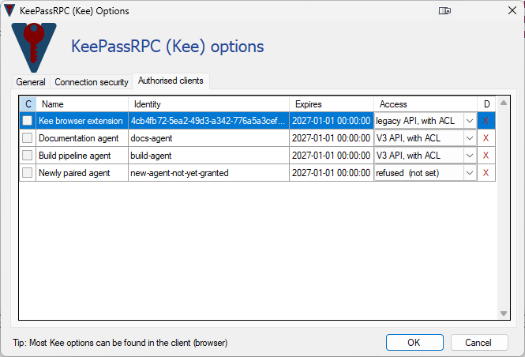
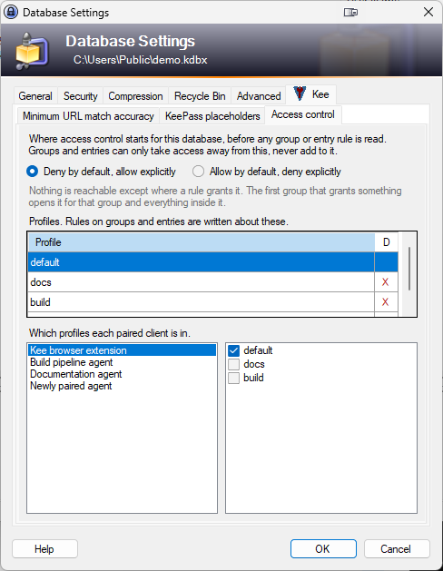
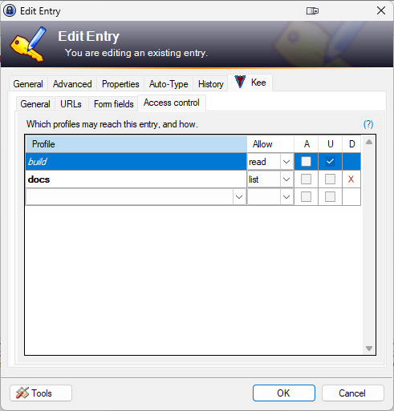
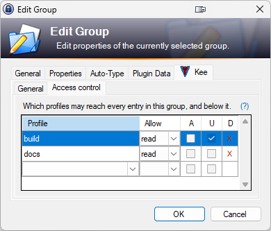
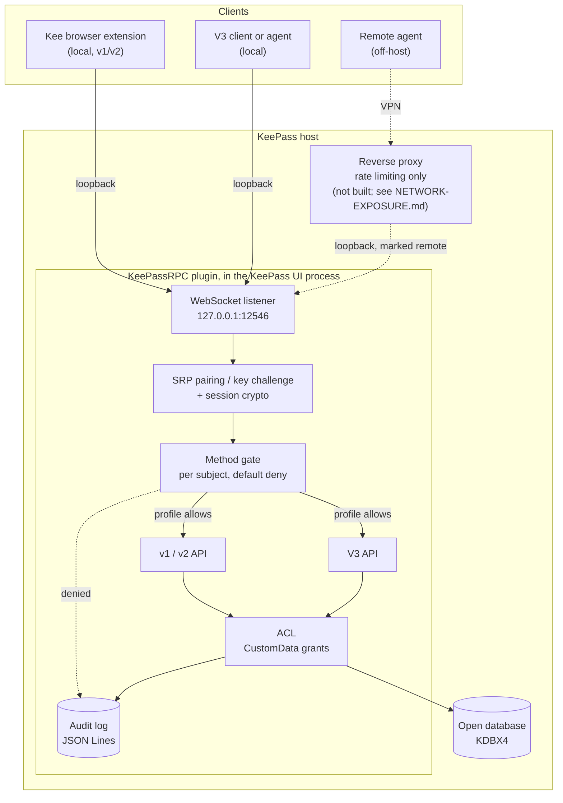
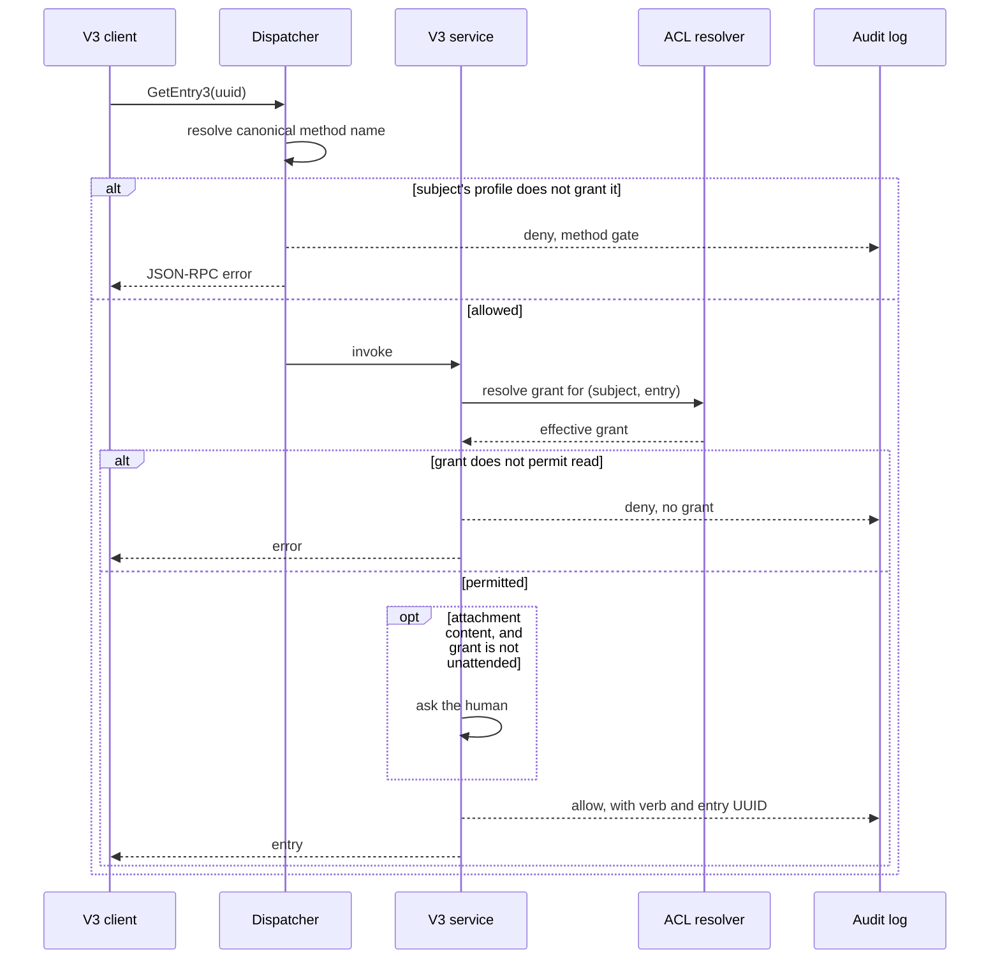

# What this fork adds

A summary of the changes this fork makes to KeePassRPC, for anyone deciding whether to read the rest
of the documents or to merge any of it.

Everything here is additive. **v1 and v2 behave exactly as they did**, which is not a courtesy but a
requirement: the Kee browser extension cannot be updated in step with this plugin, and one of the
clients on the v1 API resolves secrets in production.

The design is in [`V3-DESIGN.md`](V3-DESIGN.md), what the controls are actually worth is in
[`THREAT-MODEL.md`](THREAT-MODEL.md), and the analysis of reaching the plugin from off-host is in
[`NETWORK-EXPOSURE.md`](NETWORK-EXPOSURE.md). [`TODO.md`](TODO.md) tracks state.

## Why

Upstream's API answers one question well: *what should the browser type into this form?* Its DTOs
carry a username and a password, and its read path walks a per-entry config blob rather than the
entry itself, so a custom string added in the KeePass UI is invisible until somebody registers it on
the entry's Kee tab.

Automation asks a different question: *give me this one secret, and nothing else.* That needs two
things upstream does not have. Access to the whole entry: real custom strings, notes, attachments.
And a way to give one caller a narrow, revocable, audited slice of the database, because the callers
are increasingly AI agents whose instructions are partly attacker-controlled.

## What is added

| | |
| --- | --- |
| **V3 API** | Full-entry access: real custom strings, notes, attachments. Reads `pwe.Strings` and `pwe.Binaries` directly rather than through the v1/v2 entry-config machinery. Feature-gated behind `KPRPC_FEATURE_DTO_V3`. |
| **Method gate** | A per-subject allowlist of JSON-RPC methods, default deny, enforced before the request reaches the service. Profiles are code, not data, so a method added by a future upstream merge is denied until a human places it. |
| **ACL** | Per-entry `(profile, verb, object)` grants stored in `CustomData`, inherited top-down and narrow-only. Verbs form a ladder: `none`, `list`, `read`, `write`, `delete`, with `attachments` and `unattended` as separate flags. Profiles are defined per database and clients are assigned to them, so a rule is about a job rather than about a machine. |
| **Audit log** | JSON Lines, outside the database. Records what was touched and whether it was allowed, by entry UUID, never by title or value. |
| **Session crypto v2** | Ephemeral P-256 ECDH per connection, HMAC-SHA256, per-direction sequence numbers. Negotiated; a client that does not ask gets the original suite unchanged. |
| **2048-bit SRP** | Pairing can run in the RFC 5054 2048-bit group instead of upstream's 512-bit one. Negotiated the same way. |
| **Remote awareness** | The plugin can tell an off-host connection from a local one and holds it to stricter requirements. Nothing here binds a port off loopback. |
| **An RTF injection fix** | Upstream defect: the pre-authentication dialog concatenated a caller-supplied description into its RTF unescaped. Fixed here; still present upstream. |
| **A Python protocol client** | `clients/python/`, implementing pairing, session crypto and JSON-RPC. Its test suite implements the server side independently from the C# and checks the two agree. |

## The parts that are load-bearing

**The method gate is the outer boundary, not the ACL.** v1 and v2 are otherwise unguarded, so a
client that simply declines to use V3 reaches every entry in every open database. Guarding only the
new API would be decorative. The ACL can also be extended to cover v1 and v2 per subject.

**Grants live in their own `CustomData` key**, not in custom string fields and not as a property on
an upstream model class. `CustomData` is a different dictionary from `pwe.Strings`, and V3's field
API has no code path to it, so a client cannot reach a grant by writing a cleverly named field. That
is a structural boundary rather than a filter on names, which would lose to case folding and
whitespace. It requires KDBX 4 and a plugin-side editor, since `CustomData` is not editable in the
stock dialog. The plugin needs KeePass 2.48 or newer, which is what the packaged `.plgx` has always
asked for; the ACL alone would run on 2.35, where KDBX 4 and group and entry custom data arrived.

**Everything is negotiated by feature flag**, following upstream's own `KPRPC_FEATURE_DTO_V2`
pattern. A client that declares nothing new sees no change at all.

## The new UI

Two additions, both bolted onto dialogs upstream already has rather than replacing them.

### Client access

Upstream's "Authorised clients" tab, which already listed every paired client, with the access
decision added to it. It was a tab of its own to begin with, and that was a mistake: two tabs listing
the same clients by name and identity meant two places to look, two places to keep in step, and a
revoke gesture on one that said nothing about the access on the other.

Each client holds one of five settings, from `refused` through `legacy API, unrestricted`, which is
what the Kee browser extension needs, to `V3 API, with ACL`. That is one choice rather than the
profile-plus-tickbox pair it replaced, because the two were never independent and the combination
they implied for a V3 client could not occur.

The leading "C" marks a client that is connected right now. Access is chosen on the client's own
row, and the red X forgets a client outright: its key, so it
cannot authenticate; its access, so pairing again under the same identity cannot silently restore
what it used to be allowed; and its place in the index. Any connection it still holds is closed.
Both are deferred until the dialog is accepted, so Cancel means cancel.

Pairing asks the same question at the moment it completes, because a client that has just paired can
call nothing and the person who typed the pairing code is the only one who can say what it should
reach. That prompt defaults to refusing, and dismissing it changes nothing.

The clients and profiles shown are invented for the screenshots. `build-agent` and `docs-agent` hold `v3`;
`kee-browser-extension` holds `legacy`, which is every v1 and v2 method, and is additionally marked
so that ACL grants apply to those APIs too; `new-agent-not-yet-granted` has no setting of its own,
which reads as "refused  (not set)" and means nobody has answered for it yet. A newly paired client
is useless until a human grants it something, which is the intended behaviour and the most common
surprise.

Clients paired before this plugin existed are the exception, and only once. A default-deny gate
arriving on a working installation would refuse all of them, including whatever resolves secrets
over v1 today, so on its first start the plugin gives each of them the access it already had,
`legacy API, unrestricted`, and records that it has done so. It grants nothing wider than those
clients held, covers nobody paired afterwards, and every grant it makes is an ordinary row that can
be read and narrowed.

### Access control

A page inside the plugin's own "Kee" tab, on the entry and group dialogs. It edits the grants for
that object.

It goes inside that tab rather than beside it because the plugin should own one tab on somebody
else's dialog, not two. The two dialogs are not built alike, so it adapts: the entry already keeps
its Kee settings in a nested strip and the editor simply joins it, while the group dialog has a
single flat control and gets a strip made for it, with its existing settings on the first page.

The database dialog has a page of its own, and it holds one decision rather than a second grant
table: where access control starts for the whole file, deny by default or allow by default.

**Rules are about profiles.** The database defines them, clients are assigned to one or more, and a
client with no assignment is in `default`, which cannot be deleted. A client in several profiles
holds the widest of what they grant. That is why a rule needs one column to say who it is for rather
than the client name and paired identity it used to need.

**Deny by default is a weak deny.** Nothing is reachable until a rule grants it, but it is a
starting point rather than a floor, so the first group that grants something opens it for that group
and everything inside. A rule of `none` for `*` on the root group is the strong version, and nothing
below can raise that.

Rules are stored as allowances whichever mode a database is in: the verb is the most a profile may
do. What the table calls them follows the database, because on an allow-by-default database every
rule takes access away rather than granting it. The column is headed "Allow" in one mode and "Deny"
in the other, and the value is shown from the matching side: a stored `read` reads as "allow read"
in one and "deny write" in the other, which is the same rule said twice.

**Allow by default reverses what every rule means**, so the dialog asks before doing it: each client
then holds everything except where a rule takes it away, and rules written as permissions now read
as restrictions. What does not change is how rights combine. Groups and entries can only narrow,
whichever the default is; the setting decides what they narrow from.

The grants themselves stay on the groups and entries, the root group's being the widest a database
has. A second grant table on the database dialog would put the widest rules in two places at once.

Grants are edited in the table itself. The blank row at the bottom adds one, and the red X takes one
back: it appears only on a row this level stores, since a purely inherited rule is not this level's
to remove. A right-click or Delete does the same, and the profile column is a pick list that can
also be typed into, because a profile can be named before it exists, which is a legitimate order
when the rules are written before the profile is defined. A new row starts at the tightest value the mode offers, so naming a profile and
stopping there produces a rule that is valid and is the safe one.

What a level inherits is shown alongside what it stores, and the weight of the profile name says
which is which. Italic is inherited and left alone; bold is inherited and narrowed here; upright is
a rule that exists only at this level. In the screenshot the `build` profile holds its group's
`read` without a confirmation prompt, and `docs` inherits `read` from the same group but is cut to
`list` for this one entry, so it may see the entry exists and nothing more.

The same tab appears on groups, with wording that changes to say what the scope is. Showing the inherited rules is not decoration: a tab listing only an entry's own grants reports
an empty table for an entry that a group grant already opens wide, and an operator reading that
empty table is being invited to grant more. Three rules keep the display honest. Inherited rows are
never written to this level, or a rule meant to follow its group would freeze at whatever it said
the first time somebody opened the dialog. An override may only narrow, and a wider one is refused
and marked rather than stored, because the resolver would ignore it anyway. And taking an override
back restores the inherited values in place instead of removing the row, since that rule is not this
level's to delete.

Both dialogs are upstream's and both keep the size upstream gave them. They are grown only if they
cannot show the editor at its smallest, because the way this layout degrades is to drop the grant
table entirely, and an access control editor that silently shows an empty table is worse than one
that fails to open. Only the height ever changes: widening would strand upstream's OK and Cancel
buttons and leave its banner bitmap short.

## How a request flows

Three call paths coexist. The first is upstream's, unchanged.

The dotted path is not deployed. The plugin binds loopback and stays there; what exists today is the
plugin's ability to recognise a connection as remote and to demand more of it.

### What differs between the three

| | Local legacy (Kee) | Local V3 | Remote |
| --- | --- | --- | --- |
| Transport | loopback | loopback | VPN, then proxy to loopback |
| Pairing group | 512-bit SRP | either, negotiated | **2048-bit required** |
| Session crypto | original suite | either, negotiated | **CRYPTO_V2 required** |
| Method gate | applies | applies | applies |
| ACL | opt-in per subject | applies | applies |
| Audit `remote` field | `false` | `false` | `true` |

A remote connection is recognised by a non-loopback peer address, or by a marker segment in the
request path that the proxy sets and the client cannot influence. Both requirements above are
refusals, not downgrades: a remote client that has not asked for the stronger crypto is turned away
with an error naming the feature it needs.

### A single V3 read

Both outcomes are recorded. A log of refusals alone answers "what was blocked" but not "what did it
read", and the second question is the one that matters after an agent has misbehaved.

## What this fork does not claim

Worth stating plainly, because a control credited with more than it does will eventually be trusted
for something it cannot carry.

**Everything lives in one trust domain: the Windows user account.** The plugin runs in the KeePass
process, the database is decrypted in that process's memory, and every paired key is at rest under
DPAPI CurrentUser. A process running as that user can read a key and present itself as any subject.
The method gate and the ACL are a boundary between a *client* and the parts of the database that
client should not reach. They are not a boundary between an attacker and the database, and they do
not survive local code execution as the user.

That is not a gap to be closed by adding checks here. It is the shape of the problem, and the
controls are aimed squarely at the threat that does exist: a legitimate, authenticated client asking
for more than it should, which is exactly what a prompt-injected agent is.

## State

Built and verified against a live KeePass: the V3 API, the method gate, the ACL and its editor, the
audit log, the negotiated session crypto, the 2048-bit group, remoteness detection and the RTF fix.
469 C# tests and 137 Python tests.

Not built: everything in [`NETWORK-EXPOSURE.md`](NETWORK-EXPOSURE.md) beyond the plugin, which is
infrastructure rather than code. Two controls proposed there were considered and deliberately
rejected; the reasoning is recorded with them so it is not re-proposed.

## On merging any of this upstream

Nothing here has been offered upstream, and most of it probably should not be: it serves a use case
upstream has not taken on. Three pieces are more separable than the rest.

- **The RTF escaping fix** is upstream's defect and is not specific to anything here.
- **The session crypto** is negotiated and affects no client that does not ask for it.
- **The 2048-bit SRP group** is likewise negotiated, and the only cost is one constant and a wider
  `BigInteger`.

The V3 API, the method gate and the ACL are a different matter. They are coherent as a set and
awkward apart, and they impose a default-deny posture that would break every existing installation
on upgrade unless carefully staged.
